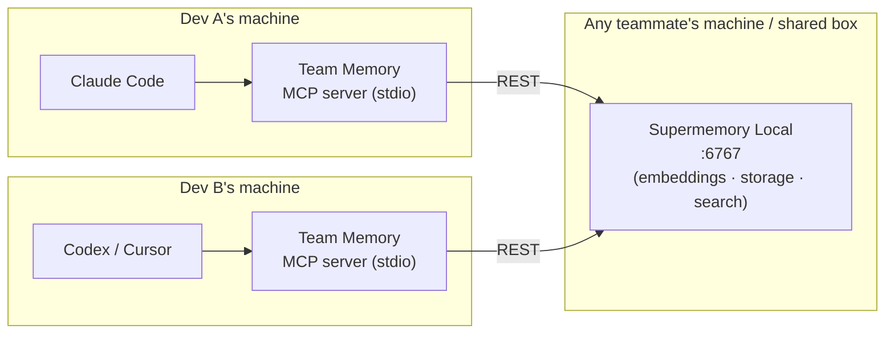

# Team Memory — Blueprint

> One team, one memory. Shared context for every coding agent on your team, powered by Supermemory Local.

## 1. Problem

Every developer's coding agent starts every session with amnesia. When Dev A's agent spends an hour discovering that "the staging migration breaks unless you seed first," Dev B's agent rediscovers it tomorrow. Team knowledge lives in Slack threads, PR comments, and people's heads — none of which an agent can query. Existing memory tools (Supermemory app, mem0, ChatGPT memory) are all **per-user**; nothing gives a *team* of agents a shared brain.

## 2. Solution

An **MCP server** that connects any coding agent — Claude Code, Codex CLI, Cursor, Windsurf — to a **shared Supermemory Local instance** owned by the team. Agents recall team knowledge before they work, remember lessons after they work, and see what other agents are doing right now.

Everything runs on the team's own machines. No cloud, no SaaS, no data leaving the network.

## 3. Architecture



- **One Supermemory Local instance per team** — a single binary on any teammate's machine or a shared box on the LAN. It owns storage, embeddings, and hybrid search.
- **One lightweight MCP server per developer** — launched over stdio by the agent itself (standard MCP config). All instances point at the same Supermemory base URL, so state naturally converges in one place. No custom database, no sync protocol: Supermemory Local *is* the shared state.
- **Identity via config** — each developer sets `DEV_NAME`; the server stamps it into every memory's provenance.

### Configuration (env vars)

| Variable | Meaning | Example |
|---|---|---|
| `SUPERMEMORY_BASE_URL` | The team's Supermemory Local endpoint | `http://192.168.1.42:6767` |
| `TEAM_TAG` | Container tag isolating this team/project's memories | `acme-checkout-service` |
| `DEV_NAME` | Who this agent works for (provenance) | `praveen` |

## 4. MCP tools

| Tool | Purpose | When agents call it |
|---|---|---|
| `recall(query, category?)` | Semantic search over team memory | Before starting any task |
| `remember(content, category, files?)` | Save a lesson with auto-provenance | After solving something non-obvious |
| `whats_happening()` | List active work claims from all agents | Before editing shared code |
| `claim_work(description, files)` | Announce "my agent is working on X" | When starting a change |
| `release_work(claim_id)` | Clear a claim | When the change lands |

**Categories:** `decision` · `gotcha` · `convention` · `failed-approach` · `wip`

**Provenance (attached automatically by the server, never trusted from the model):** developer name, timestamp, current git branch + commit SHA, repo name. Stored as Supermemory metadata so recalls can say *"praveen learned this on `main` at `51a2f46`, 2 days ago."*

### Memory document shape

```json
{
  "content": "The staging migration fails unless the seed script runs first. Run `make seed` before `make migrate` on staging.",
  "containerTag": "acme-checkout-service",
  "metadata": {
    "category": "gotcha",
    "author": "praveen",
    "branch": "main",
    "commit": "51a2f46",
    "files": "migrations/,Makefile",
    "kind": "team-memory"
  }
}
```

Work claims are just memories with `category: wip` plus a `claim_id` and `status` — claiming writes one, releasing updates it. Reusing Supermemory as the coordination store keeps the whole system one moving part.

### Design rule: store what git can't tell you

Code structure is never memorized — it goes stale the moment someone refactors. Memory holds *decisions and why*, *failed approaches*, *gotchas*, *conventions*, and *live work claims*. This rule ships in the agent conventions file (below), not just the docs.

## 5. Agent conventions (`CLAUDE.md` / rules file)

A short snippet teams drop into their repo that tells agents how to behave:

- **Start of task** → call `recall` with the task topic; call `whats_happening` before editing.
- **During** → `claim_work` on the files you're changing.
- **End of task** → `remember` any non-obvious lesson (one per lesson, concise); `release_work`.
- Never store secrets, tokens, or anything derivable from the code itself.

## 6. Tech stack

| Piece | Choice | Why |
|---|---|---|
| MCP server | Python + FastMCP | Fastest path to a robust stdio server; team knows Python |
| Supermemory client | REST via `httpx` (SDK if compatible with Local) | Local exposes the standard v3 API |
| Backend | Supermemory Local binary | The hackathon's one requirement — and genuinely the right engine |
| Git provenance | `git rev-parse` at tool-call time | Zero-dependency, always current |

## 7. Demo script (≤3 min video)

1. **Setup shot (15s):** one terminal starts Supermemory Local — "the team's entire memory layer, one command, fully local."
2. **Agent A (60s):** Claude Code session as *Dev A*. Hits a tricky failure, figures it out, calls `remember` (gotcha, with provenance shown).
3. **Agent B (60s):** fresh Codex/Claude Code session as *Dev B* on another checkout. Given a related task, calls `recall` — instantly gets Dev A's lesson, cites it, avoids the trap. Then `whats_happening` shows Dev A's active claim on `payments/`, so B works elsewhere. **This is the money shot: two different agent brands, one brain.**
4. **Close (30s):** the pitch — per-user memory exists; *team* memory for agents doesn't. Until now. All local.

## 8. Build timeline (July 10–13)

| Day | Goal |
|---|---|
| **Thu 10** | Repo + blueprint ✅ · Supermemory Local installed & verified · MCP server skeleton with `remember`/`recall` working end-to-end |
| **Fri 11** | Provenance stamping · claims (`claim_work`/`whats_happening`/`release_work`) · conventions file · test from two agent sessions |
| **Sat 12** | Polish, error handling, README quickstart · record demo video · draft X/LinkedIn posts |
| **Sun 13** | Buffer · submit Google Form + #project-showcase post + X + LinkedIn — hours before 23:59 PST |

**Cut from hackathon scope (roadmap material):** curation gate for proposed memories, commit-anchored staleness auto-expiry, PR-mining ingestion, web dashboard.
